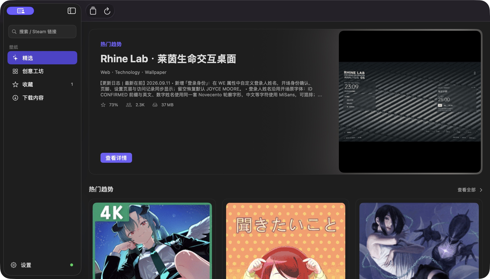

<p align="center">
  
</p>

<h1 align="center">Wallpaper Browser</h1>

<p align="center">
  A native macOS client for discovering, inspecting, and downloading Wallpaper Engine Workshop content.
</p>

<p align="center">
  
  
  <a href="LICENSE"></a>
</p>

## Overview

Wallpaper Browser brings the Steam Workshop browsing experience to a focused native macOS app. Search for wallpapers, explore authors and collections, inspect rich item details, and download video wallpapers through SteamCMD.

## Preview

<p align="center">
  
</p>

<p align="center"><em>The Featured page with trending Workshop content.</em></p>

## Highlights

### Workshop discovery

- Browse, search, and sort Wallpaper Engine Workshop content.
- Open an author's works, avatar, and Steam profile from an item detail page, with sorting by newest or highest-rated.
- Paste an item, collection, or author URL—or a Workshop ID—into the search field and press Return to open it directly.
- Browse collections, inspect which collections contain a wallpaper, batch-load collection members, and select video items for download.
- Favorite frequently used collections and authors and open them quickly from the sidebar. Favorites are persisted locally.
- Load full item descriptions, publish/update dates, view and favorite counts, additional images, and external video previews.
- Continue browsing by tag, with sorting options for recently updated, highest-rated, and unrated items. Search preserves the selected sort order.
- Browse all supported wallpaper types, including Scene, Video, Web, and Application, with filters for rating, resolution, and topic.
- Cache browse positions independently for filters, sorting, and search. Re-entering Featured, Trending, Latest, Recently Updated, or Unrated destinations starts from the first page while returning from details preserves the previous position.
- Jump to an item by sequence number from the item counter. `scripts/check-browse-jump.sh` verifies jumps, position restoration, and pagination boundaries.

### Downloads and reliability

- Video items support extraction and download. Other item types can still be inspected and opened on Steam.
- Automatically detect SteamCMD installed through Homebrew or a custom path.
- Support Steam password, Steam Guard, and cached-session login flows.
- Download items serially to avoid conflicts between concurrent SteamCMD processes.
- Display SteamCMD download stages, progress, and download speed in real time.
- Treat a usable video file as the success condition. If `project.json` is missing or invalid, automatically locate the primary video; failures involving preview images or other supplemental files do not invalidate extraction.
- Preserve Steam Workshop source files so cached manifests remain valid. When an exact missing source record is detected, back up and repair the cache state, then retry once automatically.

### Native macOS experience

- Open downloaded wallpaper details from the title, detail button, or context menu.
- Support multi-selection, quick preview with Space, moving items to the Trash, and revealing files in Finder.
- Use a configurable disk cache for preview images, with storage usage and manual clearing available in Settings.
- Store downloaded Workshop IDs separately in app metadata so clearing the preview cache does not remove them.

## Requirements

- macOS 14 or later
- Xcode 26 or a compatible SwiftUI toolchain
- SteamCMD
- A Steam account that owns Wallpaper Engine
- A [Steam Web API key](https://steamcommunity.com/dev/apikey)

## Getting started

1. Open `wallpaper-browser.xcodeproj` in Xcode and run the app.
2. Enter your Steam Web API key in Settings.
3. Install SteamCMD, or select an existing `steamcmd`/`steamcmd.sh` executable in the app.
4. Sign in with a Steam account that owns Wallpaper Engine.
5. Select Workshop wallpapers and download them from the browser.

The Steam Web API key is stored in the macOS Keychain. Steam passwords and Steam Guard codes are passed to SteamCMD through standard input only; the app does not store these login credentials.

Downloaded videos are saved to:

```text
~/Movies/Wallpaper Browser/
```

You can change the destination in Settings.

## Build from source

```bash
xcodebuild \
  -project wallpaper-browser.xcodeproj \
  -scheme wallpaper-browser \
  -configuration Debug \
  build
```

The app launches SteamCMD as an external process, so App Sandbox is disabled. For distribution, sign the app with a Developer ID certificate and complete Apple notarization.

### Build an unsigned release package

An open-source project can build a Universal unsigned zip without an Apple Developer certificate:

```bash
./scripts/build-unsigned.sh
```

The package is written to `dist/WallpaperBrowser-<version>-universal-unsigned.zip`. After extracting it, users must right-click the app in Finder, choose **Open**, and confirm the launch the first time. Alternatively, remove the quarantine attribute from Terminal:

```bash
xattr -dr com.apple.quarantine "/Applications/wallpaper-browser.app"
```

Unsigned packages are suitable for testing through GitHub Releases, but they do not receive Apple's developer verification through Gatekeeper.

## Testing

### Offline checks

```bash
./scripts/check-browse-jump.sh
./scripts/check-workshop-api.sh
```

Offline checks cover URL parsing, legacy download metadata compatibility, favorite persistence, video-first extraction, Workshop cache recovery, detail and preview parsing, collection ordering, filtered pagination, and error handling.

### Online API checks

```bash
./scripts/check-workshop-api.sh --live
```

Online checks cover search, author works and profiles, item details, reverse collection lookup, and batched collection-member reads. They are read-only: no content is downloaded and no Steam account state is modified.

## License

This project is licensed under the [GNU Affero General Public License v3.0](LICENSE), SPDX identifier `AGPL-3.0-only`.

This is an unofficial tool and is not affiliated with or endorsed by Valve, Steam, or the developer of Wallpaper Engine. Steam, Wallpaper Engine, and related trademarks belong to their respective owners. Users are responsible for complying with the Steam Subscriber Agreement and the applicable licenses for Workshop content.
